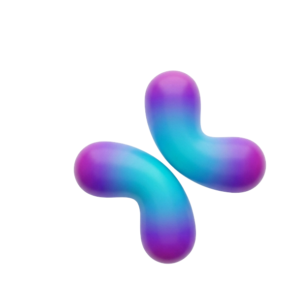

# 🧬 SomaLab — Interactive Human Anatomy Platform

<p align="center">
  
</p>

<p align="center">
  <strong>An interactive 3D visualization platform for exploring human anatomy, organ systems, and clinical health insights.</strong>
</p>

<p align="center">
  
  
  
  
  
  
</p>

---

## 📖 About The Project

**SomaLab** is a modern, browser-based interactive platform designed to make human anatomy education more engaging and accessible. Using real-time 3D rendering, users can explore anatomically accurate models of human organs, read curated clinical health insights, and navigate through the body's complex systems — all within a beautiful, responsive web interface.

This project was built as a competition entry, combining cutting-edge web technologies with medical education to create a unique digital experience.

### 🎯 Key Goals
- Make anatomy learning **visual, interactive, and accessible**
- Provide a **premium UI/UX** experience across all devices
- Serve as both an educational tool and a showcase of modern web capabilities

---

## ✨ Features

| Feature | Description |
|---|---|
| 🧠 **Interactive 3D Explorer** | Full-screen, real-time 3D viewer of the human body with organ hotspots |
| 🫀 **Organ Detail Panels** | Click any organ to view detailed anatomical info with sub-hotspot navigation |
| 📰 **Clinical Insights (Content)** | Bento-grid layout of curated health articles with embedded 3D model previews |
| 📱 **Fully Responsive** | Optimized for mobile, tablet, and desktop |
| 🌗 **Modern UI/UX** | Glassmorphism, micro-animations, smooth page transitions |
| 👨‍👩‍ **Male & Female Models** | Toggle between anatomically distinct male and female body models |
| 💡 **Particle Background** | Dynamic animated particle system on the landing page |
| 🔍 **Sub-hotspot Navigation** | Drill-down from body systems to specific organs and sub-structures |

---

## 🛠️ Tech Stack

### Core Framework
| Technology | Version | Purpose |
|---|---|---|
| [React](https://react.dev) | v19 | UI component framework |
| [Vite](https://vite.dev) | v8 | Build tool & dev server |
| [React Router DOM](https://reactrouter.com) | v7 | Client-side routing |

### 3D Rendering
| Technology | Version | Purpose |
|---|---|---|
| [Three.js](https://threejs.org) | v0.183 | 3D graphics engine |
| [React Three Fiber](https://docs.pmnd.rs/react-three-fiber) | v9 | React renderer for Three.js |
| [React Three Drei](https://github.com/pmndrs/drei) | v10 | Three.js helpers & abstractions |
| [React Three Postprocessing](https://github.com/pmndrs/react-postprocessing) | v3 | Post-processing visual effects |

### Animation & UI
| Technology | Version | Purpose |
|---|---|---|
| [Framer Motion](https://www.framer.com/motion/) | v12 | Advanced animations & transitions |
| [GSAP](https://gsap.com) | v3 | High-performance timeline animations |
| [Lucide React](https://lucide.dev) | v1 | SVG icon library |

### Styling
- **Vanilla CSS** — Custom design system with CSS variables
- **Glassmorphism** — `backdrop-filter: blur()` layered card effects
- **CSS Grid & Flexbox** — Bento-style responsive layouts
- **Google Fonts (Inter)** — Modern, clean typography

---

## 🚀 Getting Started

### Prerequisites

Make sure you have the following installed on your machine:
- [Node.js](https://nodejs.org) **v18 or higher**
- [Git](https://git-scm.com)
- A package manager: **npm** (comes with Node.js)

### Installation & Running Locally

**1. Clone the repository**
```bash
git clone https://github.com/MuchhammadRevaldy/3d-human-web.git
cd 3d-human-web
```

**2. Install dependencies**
```bash
npm install
```

**3. Start the development server**
```bash
npm run dev
```

**4. Open in browser**

The app will be available at: `http://localhost:5173`

### Build for Production

```bash
npm run build
```

The production-ready files will be output to the `dist/` folder.

To preview the production build locally:
```bash
npm run preview
```

---

## 📁 Project Structure

```
3d-human-web/
├── public/
│   ├── models/                   # 3D model files (.glb)
│   │   ├── realistic_human_heart.glb
│   │   ├── human-brain.glb
│   │   ├── dna.glb
│   │   ├── eukaryotic_cell.glb
│   │   └── ...
│   ├── somalab_logo.png          # App logo
│   └── vite.svg
│
├── src/
│   ├── components/               # Reusable UI components
│   │   ├── Navbar.jsx            # Responsive navbar with mobile hamburger menu
│   │   ├── Footer.jsx            # Global premium footer
│   │   ├── BodyModel.jsx         # Male/female 3D body model renderer
│   │   ├── InternalOrgans.jsx    # Internal organ 3D model loader
│   │   ├── OrganHotspots.jsx     # Clickable organ hotspot overlays
│   │   ├── SubHotspotInfoView.jsx# Sub-organ detail panels & navigation
│   │   ├── Sidebar.jsx           # Information sidebar (desktop)
│   │   ├── SplashScreen.jsx      # App loading / splash screen
│   │   ├── PageTransition.jsx    # Animated page entry/exit wrapper
│   │   ├── ParticleBg.jsx        # Animated particle background
│   │   ├── BubbleBg.jsx          # Decorative bubble background
│   │   ├── CrosshairCursor.jsx   # Custom crosshair cursor for Explorer
│   │   ├── MobileInlineVideo.jsx # Mobile video component
│   │   └── panels/               # Sub-panel components for organ details
│   │
│   ├── pages/                    # Route-level page components
│   │   ├── Home.jsx              # Landing page with 3D hero model
│   │   ├── Explore.jsx           # Full-screen interactive 3D explorer
│   │   ├── Content.jsx           # Clinical insights bento grid
│   │   ├── Article.jsx           # Full article reader pages
│   │   ├── About.jsx             # About the platform
│   │   └── Contact.jsx           # Contact form page
│   │
│   ├── App.jsx                   # Root component with route definitions
│   ├── main.jsx                  # React DOM entry point
│   ├── index.css                 # Global CSS variables, resets, fonts
│   └── layout.css                # Layout system, navbar, page styles
│
├── package.json                  # Project metadata & dependencies
├── vite.config.js                # Vite bundler configuration
└── README.md                     # Project documentation
```

---

## 🗺️ Pages & Functionality

### 🏠 Home (`/`)
The landing page introduces SomaLab with:
- A **hero section** featuring a real-time 3D body model (Male/Female toggle)
- An animated **particle background** for depth
- A **feature highlights section** showcasing platform capabilities
- A global **CTA button** linking to the 3D Explorer

### 🔬 Explore (`/explore`)
The flagship feature — a full-screen, immersive 3D anatomy explorer:
- Load and interact with a **detailed human body model**
- Click **organ hotspots** on the 3D model to open info panels
- Navigate to **sub-hotspots** for granular anatomical detail
- Toggle between **male and female** anatomical models
- Custom **crosshair cursor** for a precision interaction feel
- **Sidebar panel** (desktop) with organ information and stats

### 📋 Content (`/content`)
A curated **bento-grid** of clinical health articles:
- Each card features an embedded **interactive 3D model preview** (heart, brain, DNA, etc.)
- Cards link to full **article pages** or open an in-page **modal reader**
- Fully responsive: 3D models reposition **below text** on mobile
- Smooth **hover animations** and glassmorphism card design

### 📄 Article (`/article/:id`)
Full article detail pages for specific health topics:
- Rich text content with clinical information
- Related organ information and visuals

### ℹ️ About (`/about`)
Information about the SomaLab platform:
- Project mission and goals
- Technology overview
- Team or creator information

### 📬 Contact (`/contact`)
A contact form page for feedback or inquiries.

---

## 🎨 Design System

SomaLab uses a custom design system built entirely in Vanilla CSS:

### Color Palette
| Variable | Color | Usage |
|---|---|---|
| `--bg-grad-1` | `#c8d8f5` | Background gradient start |
| `--bg-grad-2` | `#d8c8f0` | Background gradient mid |
| `--bg-grad-3` | `#e8d0f0` | Background gradient end |
| `--accent-blue` | `#5b9cf6` | Primary accent |
| `--accent-purple` | `#a78bfa` | Secondary accent |
| `--text-primary` | `#1e2a4a` | Main text color |

### Key Design Patterns
- **Glassmorphism** — White frosted glass cards with `backdrop-filter`
- **Soft depth** — Layered blurred background blobs for visual depth
- **Micro-animations** — Hover lift effects, scale transitions, staggered entrances
- **Responsive grid** — CSS Grid bento layouts collapsing gracefully on mobile

---

## 📦 Available Scripts

| Script | Command | Description |
|---|---|---|
| Dev Server | `npm run dev` | Start local development server |
| Build | `npm run build` | Create optimized production build |
| Preview | `npm run preview` | Preview the production build locally |
| Lint | `npm run lint` | Run ESLint code analysis |

---

## 🌐 Browser Support

| Browser | Support |
|---|---|
| Chrome 90+ | ✅ Full support |
| Firefox 88+ | ✅ Full support |
| Safari 15+ | ✅ Full support |
| Edge 90+ | ✅ Full support |
| Mobile Chrome | ✅ Responsive optimized |
| Mobile Safari | ✅ Responsive optimized |

> **Note:** WebGL must be enabled in the browser for 3D features to function.

---

## 🤝 Team

Built with ❤️ for the competition by the SomaLab team.

---

## 📄 License

This project is licensed under the **MIT License**. See the `LICENSE` file for more details.

---

<p align="center">
  <strong>SomaLab</strong> — <em>Explore the Human Body Like Never Before</em> 🧬
</p>
